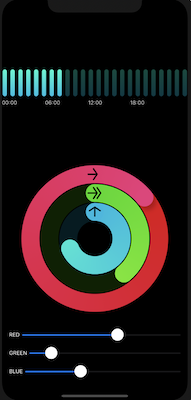

# workout-activity-rings

Learning SwiftUI via Workout app &amp; Activity Rings.

- extended sample [activity ring project](https://sarunw.com/posts/how-to-create-activity-ring-in-swiftui/) by [@sarunw](https://twitter.com/sarunw)

- adds more rings 💍💍💍
- adds input controls to fill rings 🎛🎛🎛
- full circle graphical enhancements 🌟
- add arrows on top of rings ⬆️➡️
- fix shadow rotation ❍
- adds `stand up` bar chart 🧍‍♀️🧍‍♂️📊

## Demo

| Screenshot | Movie |
|------------|-------|
|||

## Shoutouts

 - [@sarunw](https://twitter.com/) for activity rings
 - [@buildthatapp](https://twitter.com/buildthatapp) for bar charts
 - [@objcio](https://twitter.com/objcio) for everything else regarding swiftui